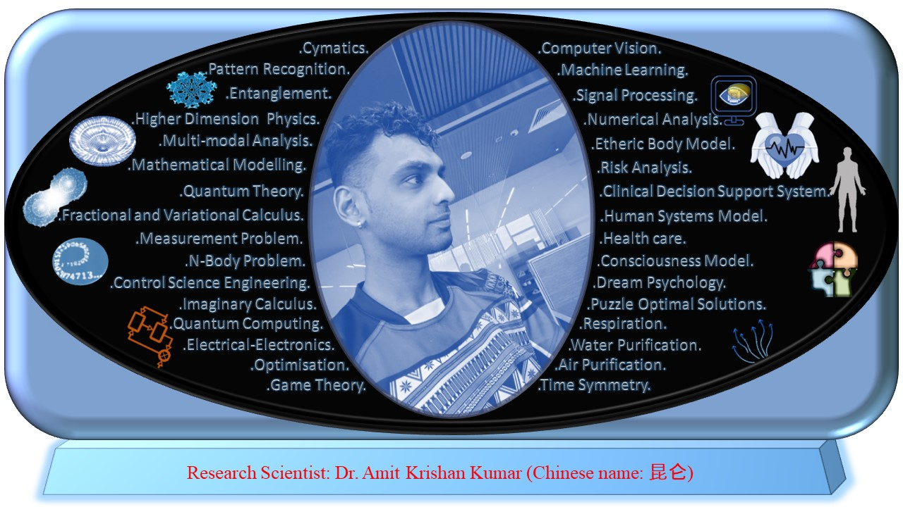

<html>
 
<meta name="description" content="Higher Dimension Research…">
    <meta name="referrer" content="origin-when-cross-origin">
<meta name="author" content="Amit Krishan Kumar">
    <meta charset="UTF-8">
   <meta name="description" content="‪Beijing Institute of Technology‬ - ‪‪Cited by 53‬‬ - ‪Computer Vision‬ - ‪Machine Learning‬ - ‪Quantum Entanglement‬ - ‪Multimodal analysis‬ - ‪Respiratory system‬"><meta property="og:title" content="Amit Krishan Kumar"><meta property="og:image" content="https://scholar.googleusercontent.com/citations?view_op=medium_photo&amp;user=h-KG0T0AAAAJ&amp;citpid=1">
  </head>
  
<body>
  <h1> Dr. Amit Krishan Kumar </h1>
            <h2> Research </h2>
            <b>Motivation and Inspiration 
  
 Intriguing research which inspires and motivates Amit Krishan Kumar are <b> quantum inpired approaches and theories, higher dimensional research, health care, and math </b> <em> Served up by our friendly team, every day of the week, our mouthwatering Sunday roast and weekday carvery are sure to be a hit with all the family. </em>
 The research questions are; 1) does disease enter a subtle body like vital-breath body (prana body) before showing symptoms to the physical body; 2) can healing of the prana body via pranayam heal the incurable; how does the breathing patterns, breathing techniques, respiratory disease, and respiratory flow help in modelling the prana sharir (body). Moreover, the fact of the statement, ‘we breathe in as soon as we are born and breathe out just before death, in between we manage the breathing’, motivates deep research on the respiratory system. Coronavirus disease targets the lungs. The outbreak of the coronavirus which resulted in a world pandemic during the course of this study also motivates this research. The most commonly observed problem in remote care during the outbreak was false alerts in health care. Considering the mass number of populations being affected on daily basis, require a system where correct health status and relevant health care could be provided. Optimising decision making in clinical decision support could reduce alert fatigue. Quantum-inspired approach to bimodal data especially the very unique quantum en-
tanglement, provides answers to many questions especially when considering immeasurable quantities. The quantum-inspired algorithm goes deeper and applies the fantastic laws of the quantum world to data science where it links the objective truth with the subjective and the dimensional truth for different frames of reference. 
    <h2> </h2>
            <b>Research Interests</b>
  
 Specific research interest include 

<a href = "about.html"> Research Profile of Amit Krishan Kumar </a>  
</body>
  
</html>
