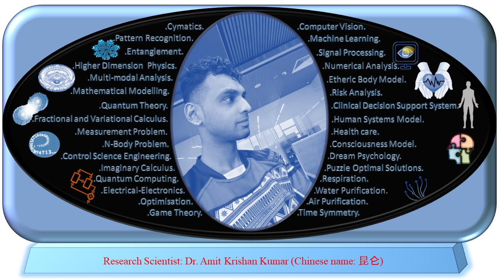

<html>
<h1> Dr. Amit Krishan Kumar </h1>

  <a href = ""> Research Profile</a> &nbsp;&nbsp;&nbsp;&nbsp; <a href = ""> Publications </a> &nbsp;&nbsp;&nbsp;&nbsp;  <a href = "https://scholar.google.com/citations?user=h-KG0T0AAAAJ&hl=en"> Google Scholar </a> &nbsp;&nbsp;&nbsp;&emsp; <a href = "https://orcid.org/0000-0002-0173-2081"> ORCID </a>   
  
   
  
    <head>
<meta name="description" content="Higher Dimension Research…">
    <meta name="referrer" content="origin-when-cross-origin">
<meta name="author" content="Amit Krishan Kumar">
    <meta charset="UTF-8">
   <meta name="description" content="‪Beijing Institute of Technology‬ - ‪‪Cited by 53‬‬ - ‪Computer Vision‬ - ‪Machine Learning‬ - ‪Quantum Entanglement‬ - ‪Multimodal analysis‬ - ‪Respiratory system‬"><meta property="og:title" content="Amit Krishan Kumar"><meta property="og:image" content="https://scholar.googleusercontent.com/citations?view_op=medium_photo&amp;user=h-KG0T0AAAAJ&amp;citpid=1">
  </head>
  

  
<html>
